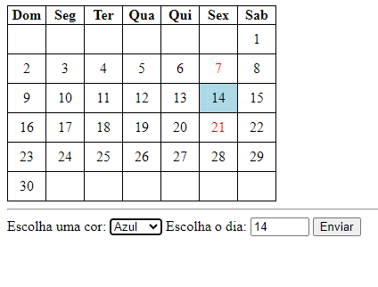

# Indice

[Projeto Calendário Interativo](#-projeto-calend%C3%A1rio-interativo)    
[Descrição](#-descri%C3%A7%C3%A3o)  
[Funcionalidades](#%EF%B8%8F-funcionalidade)   
[Tecnologias utilizadas](#-tecnologias-utilizadas)   
[Fontes consultadas](#-fontes-consultadas)  
[Autores](#-autores)  

# 🚀 PROJETO CALENDÁRIO INTERATIVO
 

## 📝 Descrição 
- O calendario interativo é uma interface criada através de html, css e js. Com o intuito de trabalhar habilidades na criação de um projeto que permite a interação do usuário na hora de escolher seu dia e deixa-lo destacado.

## ⚙️ Funcionalidade 
- Escolher o dia que quer marcar 

- Mudar cor do dia para deixar em destaque 

- Adição de cores na data escolhida

- Representar graficamente o passar do tempo

- 4 opções de cores

### 💻 Tecnologias utilizadas
- Git  
- GitHub  
- HTML  
- CSS  
- JS  
- Vs Code  

## 🔎 Fontes consultadas
- Professor Leonardo   

[Alura](https://www.alura.com.br/artigos/escrever-bom-readme) - Como escrever um README incrível no seu Github  
[Lohhans](https://gist.github.com/lohhans/f8da0b147550df3f96914d3797e9fb89) - Um modelo para fazer um bom README.md

## 🙎🏽 Autores 
- Geovanna Dama  
